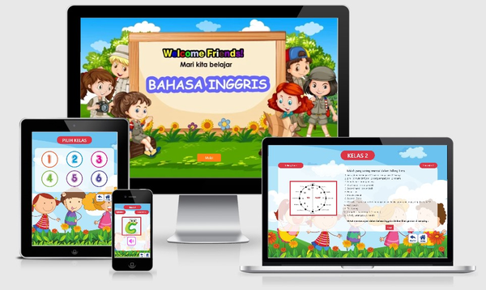
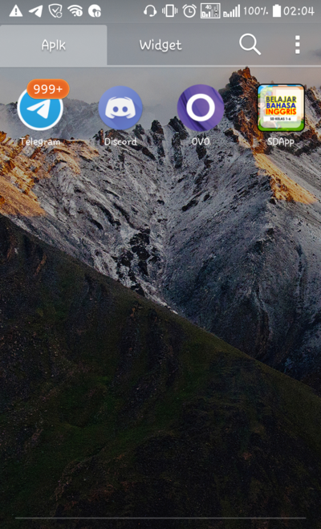
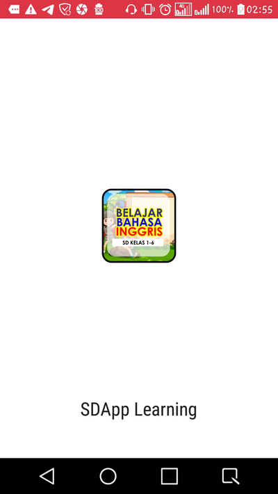
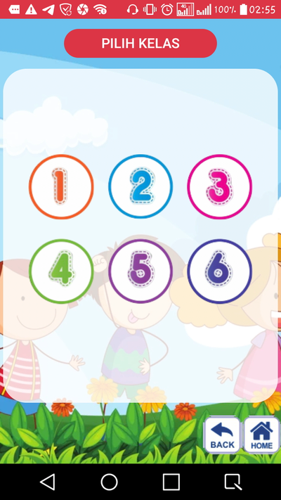
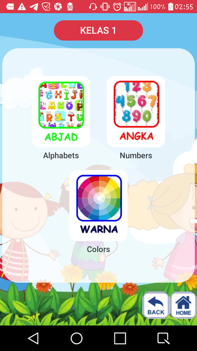

SDApp Learning - Belajar Bahasa Inggris
=======

_**SDApp Learning** - Belajar Bahasa Inggris_ adalah media pembelajaran Bahasa Inggris yang ditargetkan kepada siswa SD kelas 1 hingga kelas 6.

*Dibuat oleh Mahasiswa Semester 4 sebagai salah satu pemenuhan tugas Mata Kuliah Software Development Project, Program Studi Teknik Informatika, Sekolah Tinggi Teknik Malang Tahun 2020.*

> **ONLINE DEMO** => [SDApp Web](https://sdapp-learning-web.app)

## PROGRESSIVE WEB APP
Repository ini berisi source code aplikasi SDApp Learning versi Web tahap Development, dibangun menggunakan bahasa pemrograman TypeScript berbasis JavaScript dengan library React JS untuk manajemen komponen & halaman serta Library Workbox untuk manajemen penyimpanan Cache

### Fitur
1. Menyediakan Materi yang dikhususkan untuk siswa kelas 1 - 5 SD
2. Cross Platform
   Dapat diakses oleh sebagian besar perangkat, baik mobile maupun desktop, karena aplikasi berjalan di Browser
3. Responsive
   Memiliki Layout yang responsive dan tetap rapi walau diakses dari berbagai platform yang memiliki rasio layar yang berbeda - beda
4. Offline Ready
   Aplikasi ini tetap dapat dijalankan meskipun sedang dalam keadaan offline atau tidak memiliki koneksi internet yang baik.

### SUPPORTED PLATFORMS
**SDApp Learning** dibangun dengan konsep Trusted Web Activity, sehingga dapat dibundle menjadi satu package aplikasi yang dapat diinstall dan dijalankan seperti aplikasi native lainnya selain melalui browser. Semua Package aplikasi dapat dicari pada halaman [Release](https://github.com/AguzzTN54/) ini, atau klik masing masing link di bawah untuk mendownload setiap package
- [Windows]
- [Mac OS]()
- [Android]

   

### Cara Install Source Code
Source Code ini tidak dapat langsung dijalankan pada browser ketika telah didownload. Ada beberapa langkah dan pengetahuan khusus yang diperlukan agar aplikasi dapat berjalan dengan baik pada local server.

##### Prerequisite
- Memiliki Pengetahuan & Software NodeJS
- Memiliki Pengetahuan & Package TypeScript

##### Langkah Langkah
1. Clone Repository ini dengan command line `git clone https://github.com/AguzzTN54/SDApp-Learning.git` , atau jika belum menginstall git, bisa langsung download dan ekstrak secara manual
2. buka Terminal di dalam folder yang sama dengan file package.json lalu ketikan perintah `npm install` atau `yarn` untuk mendownload semua package dependensi yang dibutuhkan.
3. Aplikasi sudah dapat dimodifikasi sesuai kebutuhan dan untuk melakukan debuging pda tahap development dapat mengetikan perintah `npm run dev` atau `yarn run dev` di terminal, secara otomatis akan mengarahkan ke url `http://localhost:9000`
4. Untuk melakukan build aplikasi pada tahap production, ketikan perintah `npm run build` atau `yarn run build` pada terminal
5. Aplikasi siap diupload ke hosting statis
6. Aplikasi ini menggunakan Service Worker agar tetap dapat diakses meskipun sedang offline, untuk menonaktifkan service worker, cukup hapus kode `PWARegister()` di file `index.ts` dalam folder `src`

### Server Data Materi
Semua Materi untuk aplikasi berbasis Web ini berupa skema JSON dan diletakkan pada satu server khusus yang berbeda yaitu [SDApp Server](http://sdapp-server.herokuapp.com). data materi dapat direquest ke server dengan method **GET** dengan endpoint :
**/list_bab** : Menampilkan Semua Judul Bab dari semua kelas
  params :
   - kelas : _number_ ( kelas 1 - 6 )
**/data_materi** : Menampilkan semua data materi dari semua kelas
  params :
  - id      : *number* ( id Materi )
  - grade   : *number* ( kelas 1 -6 )
  - sub_bab : *string* ( Judul Bab Materi )

## LANGUAGE
1. **Visual Basic .NET**
   Aplikasi dibangun dengan Windows Form ekosistem .NET 4.7.2 menggunakan Softaware Visual Studio 2019.
   Versi ini dapat diinstall dan dijalankan pada Sistem Operasi Windows 10.
   Aplikasi berbasis Windows Form ini bisa didapatkan melalui Repository ini [SDApp VB.NET](https://github.com/AguzzTN54/SDApp).

2. **JavaScript** 👁
   > Aplikasi dibangun berdasarkan konsep Progressive Web App & Trusted Web Activity menggunakan bahasa pemrograman Javascript dengan dukungan Library React JS dan Workbox. Aplikasi versi Javascript berjalan melalui browser sehingga dapat dijalankan di berbagai platform dengan baik
   Versi Web Aplikasi SDApp dapat diakses melalui Link ini [SDApp Web App](https://sdapp-learning.web.app)

## KONTRIBUTOR
Aplikasi dibagun bersama Tim yang berjumlah 22 Mahasiswa dari kelas TI Semester 4 Tahun 2020 dengan rincian sebagai berikut :
**HEAD**
1. Iksanul Karim
**Analyst**
1. Wildan ( Head )
2. Alvarisqi N
3. Andini
4. Arga
5. Bayu Laksana Aji
6. Indhika
7. Miranda D. A.
8. Reynaldi
9. Veren
10. 
**UI/UX Designer**
1. Haikal ( Head )
2. Faris
3. Abdulloh M. A.
4. Sila
**Developer**
1. [Agustinus Y.](https://github.com/AguzzTN54) ( Head )
2. [Dimas E.](https://github.com/haidimas)
3. [M. Nabiel](https://github.com/Nabiel123)
4. [Venda](https://github.com/verielone)
**Quality Assurance**
1. Aan Krisdianto
2. Diaztin
3. Yuri Ken

## PROGRESS
`13 April 2020` : Menyusun TIM
`20 April 2020` : Menentukan Logo Tim
`11 May 2020`   : Merancang Proyek
`14 Juni 2020`  : Merancang Desain Aplikasi
`7 Juli 2020`   : Tahap Development
`----`          : Tahap Production
`----`          : Quality Assurance
`----`          : Release Aplikasi

## CLOSING
Demikian Sedikit Penjelasan mengenai Aplikasi _**SDApp Learning** - Belajar Bahasa Inggris_ , Semoga dapat bermanfaat bagi pembaca atau siapapun yang terlibat, baik secara praktis maupun teoritis. Kami menyadari waktu pengerjaan aplikasi ini cukup singkat dan hasilnya jauh dari kata sempurna, untuk itu kami sangat mengharap [kritik dan saran](https://github.com/AguzzTN54/SDApp/issues/10) yang membangun sebagai bahan evaluasi kami dalam pengembangan project selanjutnya.
Selain kritik dan saran pembaca/pengguna dapat juga melakukan submit issue ketika menemukan masalah pada aplikasi ini pada Halaman [Submt Issue](https://github.com/AguzzTN54/SDApp/issues) ini.
Akhir Kata kami Ucapkan Terimakasih